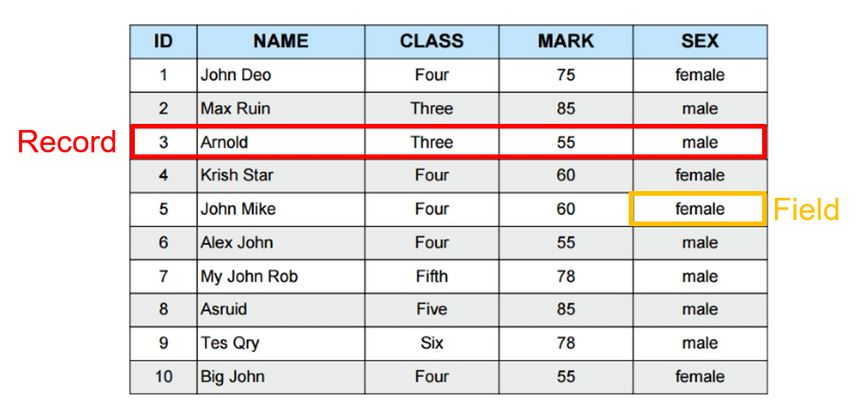
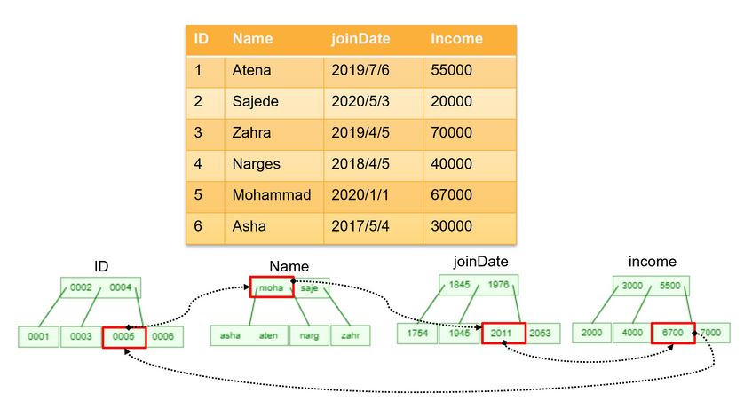
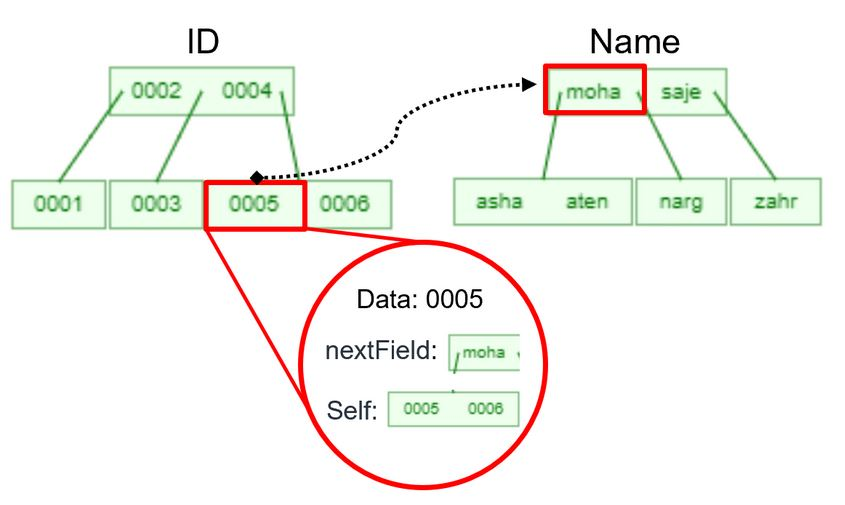
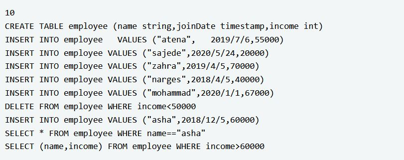
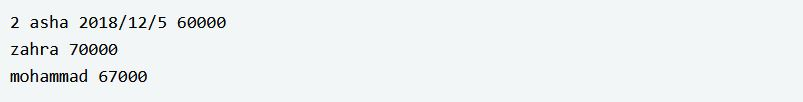

# BTree-Database
Final Project of "Data Structure and Algorithm" course at University of Tehran 
### What is Database?
A database is information that is set up for easy access, management and updating. Computer databases typically store aggregations of data records or files that contain information, such as sales transactions, customer data, financials and product information.

Databases are used for storing, maintaining and accessing any sort of data. They collect information on people, places or things. That information is gathered in one place so that it can be observed and analyzed. Databases can be thought of as an organized collection of information.
One of the most popular databases are relational databases. For exmaple a table of a database can be shown as follow:

### Goal
We want to construct a database that has a isert, delet, update, and select time complexity of O(Klogn). 
Each table has several comulmns. the columns are each in seperate BTrees and they have a link to the next consecutive columns with the nextField point in the mentioned Node.

### Table Structure
Also data will be hashed before inserting in their coresponding BTreeNode. With this idea, our data will be all in integers. Also, to select the desirable data, we'll get them from our hash table.

### Example

### Answer

